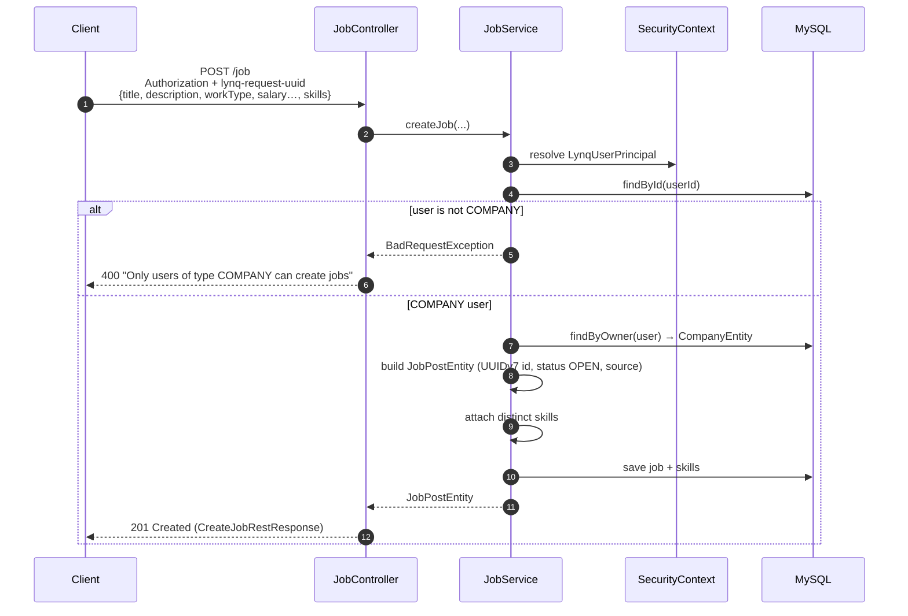
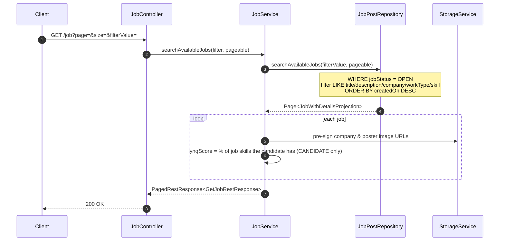
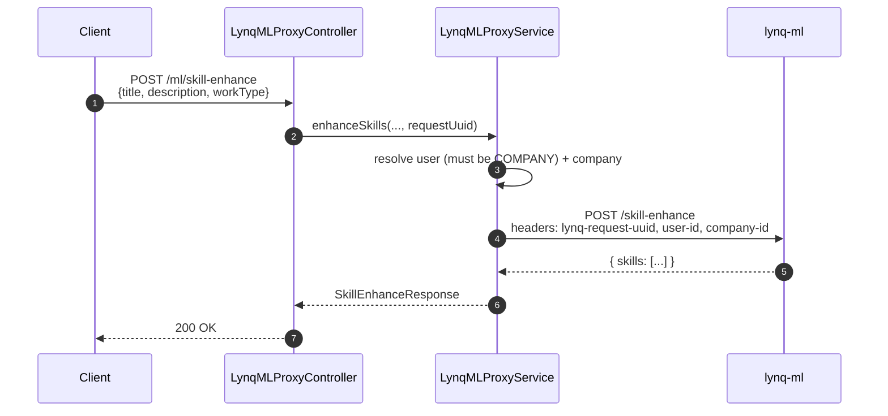

# lynq-app-backend

[](https://github.com/MatLock/UdeSA-lynq/actions/workflows/lynq-app-backend-test-workflow.yaml)
[](https://github.com/MatLock/UdeSA-lynq/actions/workflows/lynq-app-backend-test-workflow.yaml)
[](https://github.com/MatLock/UdeSA-lynq/releases)

Core application service for the Lynq platform. It owns the product domain — **user profiles**, **companies**, and **job posts** — and exposes the **job feed** that mixes Lynq-native postings with externally scraped ones, ranked per candidate with a **LyNQ match score**. It also brokers **profile/company image uploads** through S3 pre-signed URLs and **proxies skill-enhancement requests** to the `lynq-ml` service.

Authentication is **not** handled here. Every protected request is validated against the [`lynq-iam`](../lynq-iam) identity provider, and the resolved user identity is loaded into the security context for the duration of the request.

---

## Table of contents

- [Technologies](#technologies)
- [Architecture](#architecture)
- [Request lifecycle](#request-lifecycle)
- [Core flows](#core-flows)
  - [Create a job post](#1-create-a-job-post)
  - [Search the job feed](#2-search-the-job-feed)
  - [Skill-enhance proxy](#3-skill-enhance-proxy)
  - [Image upload](#4-image-upload-pre-signed-urls)
- [Data model](#data-model)
- [API reference](#api-reference)
- [Sample requests](#sample-requests)
- [Running locally](#running-locally)
- [Running with Docker](#running-with-docker)
- [Configuration](#configuration)
- [Observability](#observability)
- [Project layout](#project-layout)

---

## Technologies

| Area              | Stack                                                                        |
| ----------------- | ---------------------------------------------------------------------------- |
| Language / JDK    | Java 21                                                                      |
| Framework         | Spring Boot 4.0.6 (Web, Data JPA, Actuator, AOP, Security, Validation)       |
| Web server        | Jetty (Tomcat excluded)                                                      |
| Persistence       | MySQL 9, Hibernate / Spring Data JPA, Liquibase migrations                   |
| Inter-service     | Spring Cloud OpenFeign — clients for `lynq-iam` and `lynq-ml`               |
| Object storage    | AWS SDK v2 (S3) with pre-signed PUT/GET URLs; LocalStack for local/dev       |
| IDs               | `java-uuid-generator` (time-ordered UUIDv7) for domain entities             |
| Validation        | Hibernate Validator, Bean Validation (Jakarta)                              |
| Docs              | springdoc-openapi (Swagger UI)                                              |
| Logging           | Log4j2 + SLF4J MDC for per-request correlation IDs; `@AuditLog` aspect       |
| Metrics           | Micrometer + Prometheus registry                                            |
| Build             | Maven (Spring Boot plugin), Dockerfile on `eclipse-temurin:21-jre-alpine`   |
| Tests             | JUnit Jupiter, Testcontainers (MySQL / MockServer / LocalStack), H2, JaCoCo |

---

## Architecture

```
                          ┌───────────────────────────┐
                          │       Client (HTTP)       │
                          └─────────────┬─────────────┘
                                        │  Authorization, lynq-request-uuid
                                        ▼
              ┌───────────────────────────────────────────────────┐
              │                  Servlet filters                  │
              │   0. RequestUuidFilter          (all routes)      │
              │   1. AuthHeaderExistenceFilter  (all routes)      │
              │   2. IamAuthenticationFilter    (all routes) ─────┼──► lynq-iam
              └─────────────┬─────────────────────────────────────┘   (validate + user-info)
                            │  SecurityContext = LynqUserPrincipal
                            ▼
        ┌──────────────┬──────────────┬───────────────┬──────────────┐
        │ UserCtrl     │ CompanyCtrl  │ JobCtrl        │ LynqMLProxy  │
        │ /user        │ /company     │ /job           │ /ml          │
        └──────┬───────┴──────┬───────┴───────┬────────┴──────┬───────┘
               ▼              ▼               ▼               ▼
        ┌────────────┐ ┌────────────┐ ┌────────────┐  ┌──────────────┐
        │UserService │ │CompanyServ.│ │ JobService │  │LynqMLProxySvc│──► lynq-ml
        └─────┬──────┘ └─────┬──────┘ └─────┬──────┘  └──────┬───────┘  (skill-enhance)
              │              │              │                │
              ▼              ▼              ▼                ▼
        ┌───────────────────────────────────────┐   ┌────────────────┐
        │        Spring Data JPA repositories    │   │ StorageService │
        │  users / companies / job_posts / ...   │   │   (AWS S3)      │
        └───────────────────┬───────────────────┘   └───────┬────────┘
                            ▼                                ▼
                       ┌─────────┐                     ┌──────────┐
                       │ MySQL 9 │                     │  S3 /    │
                       └─────────┘                     │LocalStack│
                                                       └──────────┘
```

**Layers**

- **Controller** (`controller/`) — thin HTTP layer. Each interface (e.g. `JobController`) carries OpenAPI annotations; the `*Impl` maps HTTP verbs to service calls and wraps responses in `GlobalRestResponse<T>`. The authenticated user is injected via `@AuthenticationPrincipal LynqUserPrincipal`.
- **Service** (`service/`) — business logic. `UserService`, `CompanyService`, and `JobService` own their aggregates; `StorageService` owns all S3 interaction; `LynqMLProxyService` brokers calls to `lynq-ml`.
- **Client** (`client/`) — Feign clients for the two downstream services (`LynqIamClient`, `LynqMLClient`) plus their request/response DTOs.
- **Filters** (`filter/`) — cross-cutting request handling registered via `FilterConfig` with explicit ordering. `PublicPaths` is the single whitelist consulted by the auth filters (only Swagger assets are public).
- **Security** (`security/`) — `LynqUserPrincipal` is the identity resolved from the IAM token and stored as the Spring Security principal.
- **Aspect** (`aspect/`) — the `@AuditLog` annotation + `LogAspect` produce structured entry/exit logs around annotated methods, masking sensitive fields.
- **Model / Repository** (`model/`, `repository/`) — JPA entities, Spring Data interfaces, and the `JobWithDetailsProjection` used by the feed query.
- **Exception handling** (`exceptions/`, `controller/handler/`) — domain exceptions mapped to consistent error responses by `ControllerExceptionHandler`.
- **Migrations** (`resources/changelog/`) — Liquibase changelogs run on startup.

---

## Request lifecycle

Every request passes through an ordered filter chain before reaching a controller:

| Order | Filter                       | Scope                        | Purpose                                                                                          |
| :---: | ---------------------------- | ---------------------------- | ------------------------------------------------------------------------------------------------ |
| 0     | `RequestUuidFilter`          | `/*`                         | Require the `lynq-request-uuid` header; bind it to SLF4J MDC (`requestId`) and echo it back on the response for cross-service log correlation. `403` if missing. |
| 1     | `AuthHeaderExistenceFilter`  | `/*` (Swagger paths exempt)  | `401` if the `Authorization` header is missing or blank.                                         |
| 2     | `IamAuthenticationFilter`    | `/*` (Swagger paths exempt)  | Call `lynq-iam` to validate the token and fetch user info, then load a `LynqUserPrincipal` into the `SecurityContext`. `401` on invalid/expired token, `503` if IAM is unreachable. |

Spring Security itself is configured **stateless** and `permitAll` (`SecurityConfig`) — the filter chain above, not Spring Security, is what enforces authentication. CORS is open (`*` origins) and CSRF/form-login/HTTP-basic are disabled. Only Swagger UI / OpenAPI asset paths are public (`PublicPaths`).

> The `lynq-request-uuid` header is forwarded on every downstream call to `lynq-iam` and `lynq-ml`, so a single logical request can be traced across all services by its UUID.

---

## Core flows

The diagrams below use Mermaid (rendered natively by GitHub).

### 1. Create a job post

Only users of type `COMPANY` linked to a company may post jobs.



### 2. Search the job feed

The feed is a paginated, filterable list of **OPEN** jobs that mixes Lynq-native (`LYNQ`) and externally scraped postings (`LINKEDIN`, `COMPUTRABAJO`, `BUMERAN`). External jobs have no poster, so company and poster are `LEFT JOIN`ed. For `CANDIDATE` users, each job is annotated with a **LyNQ score**.



The **LyNQ score** is the percentage of a job's skills that the authenticated candidate already lists (case-insensitive, trimmed). It is `null` for `COMPANY` users, or when either the job or the user has no skills.

### 3. Skill-enhance proxy

`POST /ml/skill-enhance` forwards a job draft to `lynq-ml`, which extracts the key technical skills. Restricted to `COMPANY` users linked to a company; the `user-id` and `company-id` headers required by `lynq-ml` are derived server-side.



### 4. Image upload (pre-signed URLs)

Uploads never pass through the backend. The client asks for a short-lived (15-minute) pre-signed S3 **PUT** URL, uploads the bytes directly to S3, and the object key is persisted on the entity. When reading, the backend hands back pre-signed **GET** URLs. Re-uploading replaces the stored key and best-effort deletes the previous object.

- `GET /user/generate-upload-image?file-name=…` → key `lynq/users/{userId}/profile/{fileName}`
- `GET /company/generate-upload-image?file-name=…` → key `lynq/companies/{companyId}/profile/{fileName}`

---

## Data model

Liquibase provisions the `lynq_backend_db` schema on startup (`resources/changelog/`).

| Table                  | Purpose                                                                                  |
| ---------------------- | ---------------------------------------------------------------------------------------- |
| `users`                | Profile of a Lynq user. **`id` equals the `lynq-iam` user id** (no local credentials). `type` ∈ {`CANDIDATE`, `COMPANY`}. |
| `companies`            | Company profile, unique `name`, `owner_user_id` → `users`.                               |
| `job_posts`            | Job postings. `job_status` ∈ {`OPEN`, `CLOSE`}, `job_post_source` ∈ {`LYNQ`, `LINKEDIN`, `COMPUTRABAJO`, `BUMERAN`}, `work_type` ∈ {`REMOTE`, `IN_OFFICE`}. FKs to `users` (poster) and `companies` — both nullable for scraped jobs. |
| `job_post_skills`      | Skills required by a job (`job_id`, `skill`), unique per pair.                           |
| `user_skills`          | Skills a user has (`user_id`, `skill`), unique per pair — drives the LyNQ score.         |
| `user_resumes`         | Uploaded/generated résumés (`resume` JSON, `language`, `storage_path`).                  |
| `user_application_job` | A user's application to a job (unique per `job_post_id` + `user_id`).                    |

Domain entity IDs are time-ordered UUIDv7 strings, except `users.id`, which is inherited from `lynq-iam`. All JPA associations use `FetchType.LAZY`.

---

## API reference

Base path: `/lynq-backend-app` (Spring `server.servlet.context-path`).
**Every** request must include the `lynq-request-uuid` header and a valid `Authorization: Bearer <access token>` (the access token issued by `lynq-iam`).

| Method | Path                            | Body / Params                                                        | Description                                              |
| ------ | ------------------------------- | -------------------------------------------------------------------- | -------------------------------------------------------- |
| GET    | `/user`                         | —                                                                    | Get the authenticated user's profile (+ pre-signed image URL). |
| POST   | `/user`                         | `{userType, fullName, currentPosition?, about?, githubUrl?, linkedinUrl?, birthDate}` | Create the profile for the authenticated user.           |
| PATCH  | `/user`                         | Any subset of profile fields                                         | Partially update the profile (non-null fields only).    |
| GET    | `/user/generate-upload-image`   | `?file-name=`                                                        | Pre-signed PUT URL for the user's profile image.         |
| POST   | `/company`                      | `{fullName, currentPosition, userAbout, birthDate, companyName, companyAbout, companySize?, …}` | Create the authenticated user as a `COMPANY` and its company. |
| GET    | `/company/generate-upload-image`| `?file-name=`                                                        | Pre-signed PUT URL for the company logo.                 |
| POST   | `/job`                          | `{title, description, workType, salaryRangeDown?, salaryRangeTop?, jobPostSource, skills?}` | Create a job post (`COMPANY` users only).                |
| GET    | `/job`                          | `?page=0&size=20&filterValue=`                                       | Paginated feed of OPEN jobs; free-text filter; LyNQ score per job for candidates. |
| POST   | `/ml/skill-enhance`             | `{title, description, workType}`                                     | Extract key skills via `lynq-ml` (`COMPANY` users only). |

Responses are wrapped in `GlobalRestResponse<T>`:

```json
{ "success": true, "data": { ... } }
```

Paginated endpoints wrap the payload again in `PagedRestResponse<T>`:

```json
{ "success": true, "data": {
    "content": [ ... ], "page": 0, "size": 20,
    "totalElements": 137, "totalPages": 7,
    "hasNext": true, "hasPrevious": false
} }
```

Errors are wrapped in `ErrorRestResponse` (`{ success:false, data, reason }`). Mapping (`ControllerExceptionHandler`):

| Exception                       | HTTP status |
| ------------------------------- | ----------- |
| `BadRequestException`           | 400         |
| `ForbiddenException`            | 403         |
| `NotFoundException`             | 404         |
| `IllegalArgumentException`      | 409         |
| bean-validation failure         | 400 (`{ reason: "Invalid Fields Found", data: { field → message } }`) |
| any other `Exception`           | 500         |

OpenAPI / Swagger UI is served at `/lynq-backend-app/swagger-ui.html` (enabled in the default profile, disabled in production).

---

## Sample requests

> Substitute `$UUID` with any UUID per request (e.g. `uuidgen`) and `$TOKEN` with a `lynq-iam` access token. Default profile serves on port `8082`.

**Create your user profile**

```bash
curl -X POST http://localhost:8082/lynq-backend-app/user \
  -H "Content-Type: application/json" \
  -H "lynq-request-uuid: $UUID" \
  -H "Authorization: Bearer $TOKEN" \
  -d '{
    "userType": "CANDIDATE",
    "fullName": "John Doe",
    "currentPosition": "Backend Engineer",
    "about": "10 years building JVM services",
    "githubUrl": "https://github.com/johndoe",
    "linkedinUrl": "https://linkedin.com/in/johndoe",
    "birthDate": "1990-05-01"
  }'
```

**Get a pre-signed URL, then upload the image straight to S3**

```bash
URL=$(curl -s "http://localhost:8082/lynq-backend-app/user/generate-upload-image?file-name=avatar.png" \
  -H "lynq-request-uuid: $UUID" -H "Authorization: Bearer $TOKEN" | jq -r '.data.preSignedUrl')

curl -X PUT "$URL" --upload-file ./avatar.png
```

**Register as a company**

```bash
curl -X POST http://localhost:8082/lynq-backend-app/company \
  -H "Content-Type: application/json" \
  -H "lynq-request-uuid: $UUID" \
  -H "Authorization: Bearer $TOKEN" \
  -d '{
    "fullName": "Jane Roe",
    "currentPosition": "Head of Talent",
    "userAbout": "Hiring the best",
    "birthDate": "1985-02-11",
    "companyName": "Acme Inc",
    "companyAbout": "We build rockets",
    "companySize": 250
  }'
```

**Create a job post**

```bash
curl -X POST http://localhost:8082/lynq-backend-app/job \
  -H "Content-Type: application/json" \
  -H "lynq-request-uuid: $UUID" \
  -H "Authorization: Bearer $TOKEN" \
  -d '{
    "title": "Senior Java Engineer",
    "description": "Build the Lynq backend",
    "workType": "REMOTE",
    "salaryRangeDown": 90000,
    "salaryRangeTop": 130000,
    "jobPostSource": "LYNQ",
    "skills": ["Java", "Spring Boot", "MySQL"]
  }'
```

**Search the job feed**

```bash
curl "http://localhost:8082/lynq-backend-app/job?page=0&size=20&filterValue=java" \
  -H "lynq-request-uuid: $UUID" \
  -H "Authorization: Bearer $TOKEN"
```

**Skill-enhance a draft**

```bash
curl -X POST http://localhost:8082/lynq-backend-app/ml/skill-enhance \
  -H "Content-Type: application/json" \
  -H "lynq-request-uuid: $UUID" \
  -H "Authorization: Bearer $TOKEN" \
  -d '{ "title": "Senior Java Engineer", "description": "…", "workType": "REMOTE" }'
```

Sample response:

```json
{ "success": true, "data": { "skills": ["Java", "Spring Boot", "Hibernate", "REST"] } }
```

---

## Running locally

**Prerequisites**

- JDK 21
- Maven 3.9+ (or the bundled `./mvnw`)
- A reachable MySQL 9 (`lynq_backend_db`), a running `lynq-iam`, and — for uploads — an S3 endpoint (LocalStack works)

The default `application.yaml` targets `localhost:3306` (MySQL, `root` / `federico`), `lynq-iam` at `http://localhost:8080/lynq-iam`, `lynq-ml` at `http://localhost:8084/lynq-ml`, and LocalStack S3 at `http://localhost:4566`. Override anything that differs.

**Steps**

```bash
# 1. Bring up the data services + IAM (easiest via the repo-root compose file)
cd ..
docker compose up -d mysql localstack lynq-iam

# 2. Build and run the backend
cd lynq-app-backend
./mvnw clean package
java -jar target/lynq-app-backend.jar

# Or run directly:
./mvnw spring-boot:run
```

Liquibase creates the schema and tables on first startup.

Service URLs (default profile):
- API: `http://localhost:8082/lynq-backend-app`
- Swagger UI: `http://localhost:8082/lynq-backend-app/swagger-ui.html`
- Actuator / Prometheus: `http://localhost:8083/actuator`

**Tests** (Testcontainers spins up MySQL, MockServer, and LocalStack — Docker must be running):

```bash
./mvnw test
```

---

## Running with Docker

The repo-root `docker-compose.yaml` provisions the whole platform — MySQL, LocalStack, `lynq-iam`, `lynq-ml` (+ Ollama), this backend, and the frontend. Run compose from the repository root (one level up):

```bash
# Build the jar first (the image just COPYs it in)
./mvnw clean package

cd ..
docker compose up --build
```

In compose the backend runs the `production` profile and is published on host ports **8082** (API) and **8083** (management), talking to `lynq-iam` at `http://lynq-iam:8080/lynq-iam` and S3 at LocalStack (`http://localstack:4566`).

---

## Configuration

Two profiles ship with the project:

- **`application.yaml`** (default) — local development; hard-coded credentials and ports (`8082`/`8083`), Swagger enabled.
- **`application-production.yaml`** — env-var driven, ports `8080`/`8081`, Swagger disabled. Activate with `SPRING_PROFILES_ACTIVE=production`.

| Variable                | Used by                                    | Notes |
| ----------------------- | ------------------------------------------ | ----- |
| `DB_URL`                | `spring.datasource.url` (JDBC URL)         | |
| `DB_USERNAME`           | MySQL user                                 | |
| `DB_PASSWORD`           | MySQL password                             | |
| `LYNQ_IAM_URL`          | `lynq.iam.url` (Feign client)              | default `http://lynq-iam:8080/lynq-iam` |
| `LYNQ_ML_URL`           | `lynq.ml.url` (Feign client)               | default `http://localhost:8084/lynq-ml` |
| `AWS_REGION`            | S3 region                                  | default `us-east-1` |
| `AWS_ACCESS_KEY_ID`     | S3 credentials                             | |
| `AWS_SECRET_ACCESS_KEY` | S3 credentials                             | |
| `AWS_BUCKET_NAME`       | Target bucket                              | |
| `AWS_ENDPOINT`          | S3 endpoint override                       | empty = real AWS; set to LocalStack (`http://localstack:4566`) for local/dev |

When `AWS_ENDPOINT` is set, the S3 client/presigner switch to **path-style** access so LocalStack works transparently.

---

## Observability

- **Logs** — Log4j2 (`log4j2-spring.xml`). Every entry carries the `requestId` MDC key set by `RequestUuidFilter`, so logs for one request correlate across `lynq-app-backend`, `lynq-iam`, and `lynq-ml` by the same UUID.
- **Audit logs** — methods annotated with `@AuditLog` are wrapped by `LogAspect`, which logs entry/exit + (sanitized) arguments. Fields named `password`, `newPassword`, `refreshToken`, and `accessToken` are masked, recursively, in both parameters and serialized bodies.
- **Health** — `/actuator/health` with `liveness`/`readiness` probes, on the management port (`8083` default / `8081` prod).
- **Metrics** — `/actuator/prometheus` exports Micrometer metrics in Prometheus format.

---

## Project layout

```
src/
├── main/
│   ├── java/com/lynq/backend/
│   │   ├── LynqAppBackendApplication.java
│   │   ├── aspect/        # @AuditLog + LogAspect (sensitive-field masking)
│   │   ├── client/        # Feign clients for lynq-iam & lynq-ml + DTOs
│   │   ├── config/        # App (S3/Jackson), Security, Filter, OpenAPI beans
│   │   ├── controller/    # Controller interfaces + impls, request/response DTOs, error handler
│   │   ├── enums/         # UserType, WorkType, JobStatus, JobPostSource, Language
│   │   ├── exceptions/    # BadRequest / Forbidden / NotFound
│   │   ├── filter/        # RequestUuid + auth-header + IAM-authentication filters, PublicPaths
│   │   ├── model/         # JPA entities
│   │   ├── repository/    # Spring Data repositories + JobWithDetailsProjection
│   │   ├── security/      # LynqUserPrincipal
│   │   └── service/       # User / Company / Job / Storage / LynqMLProxy services
│   └── resources/
│       ├── application.yaml
│       ├── application-production.yaml
│       ├── log4j2-spring.xml
│       └── changelog/     # Liquibase DDL
└── test/
    └── java/com/lynq/backend  # JUnit + Testcontainers (E2E, controllers, services, filters, models)
```