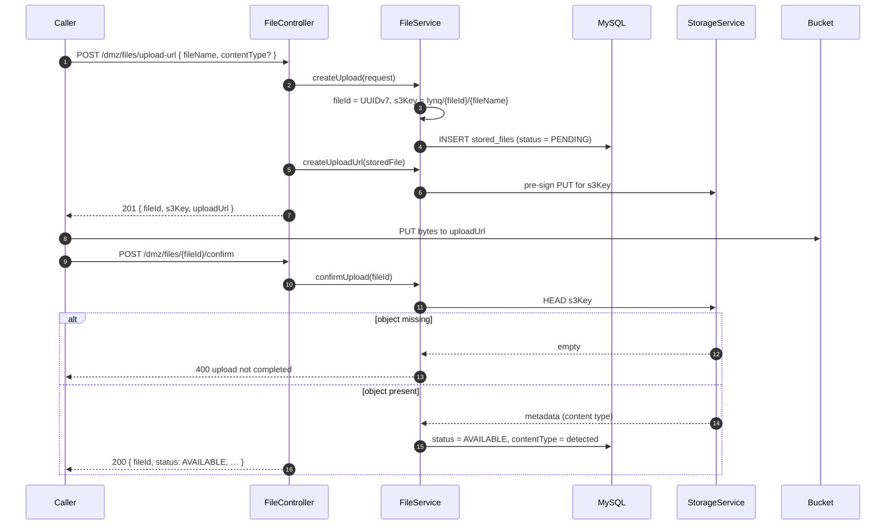
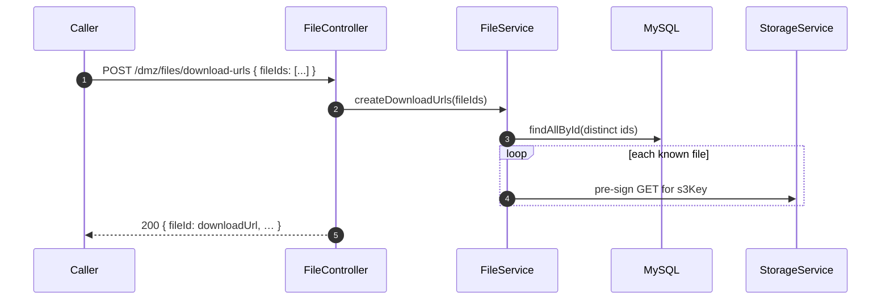

# lynq-file-storage

[](https://github.com/MatLock/UdeSA-lynq/actions/workflows/lynq-file-storage-test-workflow.yaml)
[](https://github.com/MatLock/UdeSA-lynq/actions/workflows/lynq-file-storage-test-workflow.yaml)
[](https://github.com/MatLock/UdeSA-lynq/releases)

File service for the Lynq platform. It owns **every file the platform stores** — profile images, company logos and résumé PDFs — holding the bucket credentials, the object keys and the file metadata, and handing out short-lived **pre-signed URLs** for upload and download. File bytes never pass through this service: clients PUT and GET them directly against the bucket.

Callers keep only the **file id** it hands back. [`lynq-app-backend`](../lynq-app-backend) persists that id (`lynq_file_storage_id`) against the owning user, company or résumé and reaches this service over HTTP; it holds no AWS configuration of its own.

---

## Table of contents

- [Technologies](#technologies)
- [Architecture](#architecture)
- [Request lifecycle](#request-lifecycle)
- [Core flows](#core-flows)
  - [Upload a file](#1-upload-a-file)
  - [Read a file](#2-read-a-file)
  - [Replace or delete a file](#3-replace-or-delete-a-file)
- [Data model](#data-model)
- [API reference](#api-reference)
- [Sample requests](#sample-requests)
- [Running locally](#running-locally)
- [Running with Docker](#running-with-docker)
- [Configuration](#configuration)
- [Observability](#observability)
- [Project layout](#project-layout)

---

## Technologies

| Area              | Stack                                                                        |
| ----------------- | ---------------------------------------------------------------------------- |
| Language / JDK    | Java 21                                                                      |
| Framework         | Spring Boot 4.0.6 (Web, Data JPA, Actuator, AOP, Validation)                 |
| Web server        | Jetty (Tomcat excluded)                                                      |
| Persistence       | MySQL 9, Hibernate / Spring Data JPA, Liquibase migrations                   |
| Object storage    | AWS SDK v2 (S3) with pre-signed PUT/GET URLs; LocalStack for local/dev       |
| IDs               | `java-uuid-generator` (time-ordered UUIDv7) for file ids                    |
| Validation        | Hibernate Validator, Bean Validation (Jakarta)                              |
| Docs              | springdoc-openapi (Swagger UI)                                              |
| Logging           | Log4j2 + SLF4J MDC for per-request correlation IDs; `@AuditLog` aspect       |
| Metrics           | Micrometer + Prometheus registry                                            |
| Build             | Maven (Spring Boot plugin), Dockerfile on `eclipse-temurin:21-jre-alpine`   |
| Tests             | JUnit Jupiter, Testcontainers (LocalStack), H2, JaCoCo                      |

---

## Architecture

```
                  ┌───────────────────────────┐
                  │ Caller (lynq-app-backend) │
                  └─────────────┬─────────────┘
                                │  lynq-request-uuid
                                ▼
               ┌─────────────────────────────────┐
               │    RequestUuidFilter  (/*)      │
               └────────────────┬────────────────┘
                                ▼
               ┌─────────────────────────────────┐
               │        FileControllerImpl       │  @RestController, /dmz/files/*
               └────────────────┬────────────────┘
                                ▼
               ┌─────────────────────────────────┐
               │           FileService           │  metadata + lifecycle
               └────┬───────────────────────┬────┘
                    ▼                       ▼
        ┌──────────────────────┐   ┌────────────────┐
        │ StoredFileRepository │   │ StorageService │  pre-signing, HEAD, DELETE
        └───────────┬──────────┘   └────────┬───────┘
                    ▼                       ▼
            ┌──────────────┐         ┌────────────┐
            │   MySQL 9    │         │    S3 /    │◄── browser PUTs / GETs
            │ stored_files │         │ LocalStack │    the bytes directly
            └──────────────┘         └────────────┘
```

**Layers**

- **Controller** (`controller/`) — thin HTTP layer. The interface (`FileController`) carries the OpenAPI annotations; `FileControllerImpl` maps HTTP verbs to service calls and wraps responses in `GlobalRestResponse<T>`.
- **Service** (`service/`) — `FileService` owns the metadata and the file lifecycle (`PENDING` → `AVAILABLE`); `StorageService` is the only class that touches S3 — it builds object keys, signs URLs, HEADs objects and deletes them.
- **Filters** (`filter/`) — `RequestUuidFilter`, registered on `/*` via `FilterConfig`, requires the correlation header and binds it to the SLF4J MDC.
- **Aspect** (`aspect/`) — the `@AuditLog` annotation + `LogAspect` produce structured entry/exit logs around annotated methods.
- **Model / Repository** (`model/`, `repository/`) — the `StoredFileEntity` JPA entity and its Spring Data interface.
- **Exception handling** (`exceptions/`, `controller/handler/`) — domain exceptions mapped to consistent error responses by `ControllerExceptionHandler`.
- **Migrations** (`resources/changelog/`) — Liquibase changelogs run on startup.

> **Security model.** This service carries no authentication of its own: it only enforces the `lynq-request-uuid` header. It is meant to be reached **inside the cluster** by other Lynq services (it is not exposed through the ingress), and the caller is responsible for authorizing the end user — `lynq-app-backend` validates the bearer token against `lynq-iam` and checks file ownership before delegating. Do not expose it publicly.

---

## Request lifecycle

Every request passes through a single filter before reaching the controller:

| Order | Filter              | Scope | Purpose                                                                       |
| :---: | ------------------- | ----- | ----------------------------------------------------------------------------- |
| 0     | `RequestUuidFilter` | `/*`  | Require the `lynq-request-uuid` header (403 otherwise); echo it back and bind it to the SLF4J MDC for log correlation. |

Swagger assets (`/swagger-ui*`, `/v3/api-docs*`, `/swagger-resources*`, `/webjars*`) are exempt from the header requirement. CORS is open to any origin (`CorsConfig`) so the browser can be handed pre-signed URLs.

---

## Core flows

### 1. Upload a file

Registering an upload persists the metadata as `PENDING` and returns a pre-signed **PUT** URL valid for 15 minutes. The client uploads the bytes directly to the bucket and then confirms, which flips the row to `AVAILABLE`. Confirmation is rejected while the object is not actually in the bucket, so `AVAILABLE` always means "the bytes are there".



The object key is always `lynq/{fileId}/{fileName}`. Because the id comes first, two files with the same name never collide, and the caller's domain (user, company, résumé) is deliberately **not** part of the key — this service knows nothing about it.

The `contentType` on the request is optional and only used to constrain the pre-signed PUT. On confirmation it is replaced by whatever the bucket reports for the stored object — the registered value is kept only when the bucket reports none.

### 2. Read a file

Reads are also pre-signed, so bytes never pass through this service. A single file can be signed on its own, but callers rendering a **page** of records should use the batch endpoint: it signs up to 100 files in one round-trip instead of one HTTP call per row.



Unknown ids are **omitted** from the batch response rather than failing it, so one stale reference cannot break a whole page. The single-file `GET /dmz/files/{fileId}/download-url` does the opposite: an unknown id is a `404`.

### 3. Replace or delete a file

There is no update-in-place: replacing a file means registering a new one and deleting the old. `DELETE /dmz/files/{fileId}` removes the object from the bucket and forgets the metadata, and is **idempotent** — deleting an id that is not stored succeeds without doing anything, so a retried delete is safe.

`lynq-app-backend` drives exactly this when a user picks a new profile picture: it registers the replacement, points the entity at the new id, and deletes the file it replaced.

---

## Data model

Liquibase provisions the `lynq_file_storage_db` schema on startup (`resources/changelog/`).

| Table          | Purpose                                                                 |
| -------------- | ----------------------------------------------------------------------- |
| `stored_files` | One row per stored file: `file_name`, `content_type`, `s3_key`, `status` ∈ {`PENDING`, `AVAILABLE`}, `created_on`, `updated_on`. |

File ids are time-ordered UUIDv7 strings and are the only handle other services keep.

| Status      | Meaning                                                                          |
| ----------- | -------------------------------------------------------------------------------- |
| `PENDING`   | Registered and signed, but the bytes have not been confirmed in the bucket yet.  |
| `AVAILABLE` | Confirmed: the object exists in the bucket.                                      |

A `PENDING` row whose upload is never completed leaves metadata with no object behind it. Download URLs are signed regardless of status, so a caller that never confirms gets a URL that resolves to nothing — confirm, or delete.

---

## API reference

Base path: `/lynq-file-storage` (Spring `server.servlet.context-path`), with every endpoint behind
the DMZ prefix `/dmz` — this service is reached only through [`lynq-bff`](../lynq-bff), which
validates the access token's signature before proxying.
**Every** request must include the `lynq-request-uuid` header; requests without it are rejected with `403`.

The three endpoints that **change** a file also require a `user-id` header — set by lynq-bff from
the verified token, or by lynq-app-backend from the authenticated principal. See
[Ownership](#ownership) below.

| Method | Path                          | `user-id` | Description                                                     |
| ------ | ----------------------------- | :-------: | --------------------------------------------------------------- |
| POST   | `/dmz/files/upload-url`           | required | Register a file as `PENDING` and record the caller as its owner; returns `{fileId, s3Key, uploadUrl}` (`201`). Body: `{fileName, contentType?}`. |
| POST   | `/dmz/files/{fileId}/confirm`     | required | Confirm a finished upload; marks the file `AVAILABLE` (`200`). `403` if the file belongs to someone else. |
| GET    | `/dmz/files/{fileId}/download-url`| —        | Pre-signed GET URL for one file (`200`). Not owner-scoped.      |
| POST   | `/dmz/files/download-urls`        | —        | Pre-signed GET URLs for a batch, keyed by file id (`200`). Body: `{fileIds: [ … ]}` (1–100). Not owner-scoped. |
| DELETE | `/dmz/files/{fileId}`             | required | Delete the object and its metadata; idempotent (`204`). `403` if the file belongs to someone else. |

### Ownership

`stored_files.owner_user_id` records who registered a file, and only that user may **confirm** or
**delete** it. Anyone else gets a `403`.

Reads are deliberately **not** owner-scoped. Profile images, company logos and candidate résumés are
meant to be shown to users other than the one who uploaded them, so an owner-only rule on download
URLs would break the job feed and the candidate list. There the file id is the capability:
lynq-app-backend only hands out the ids a caller is entitled to see, and the ids themselves are
never enumerated.

Rows created before `changelog/ddl/02-add-stored-file-owner.sql` have no recorded owner and stay
mutable — otherwise replacing a profile image uploaded before the migration would start failing.
Every file registered from then on has one.

OpenAPI / Swagger UI is exposed at `/lynq-file-storage/swagger-ui.html` (springdoc default).

Responses are wrapped in `GlobalRestResponse<T>`:

```json
{ "success": true, "data": { ... } }
```

`DELETE` is the exception: it returns `204 No Content` with no body.

Errors are wrapped in `ErrorRestResponse` (`{ success:false, data, reason }`). Mapping (`ControllerExceptionHandler`):

| Exception / condition                | HTTP status |
| ------------------------------------ | ----------- |
| `BadRequestException`                | 400         |
| bean-validation failure              | 400 (`{ reason: "Invalid Fields Found", data: { field → message } }`) |
| missing `lynq-request-uuid` header   | 403         |
| `ForbiddenException` (the file belongs to another user) | 403 |
| `NotFoundException`                  | 404         |
| `IllegalArgumentException`           | 409         |
| any other exception                  | 500         |

Validation rules on the request bodies:

| Field       | Rules                                                        |
| ----------- | ------------------------------------------------------------ |
| `fileName`  | Not blank; max 255 characters.                               |
| `contentType` | Optional; max 255 characters.                              |
| `fileIds`   | Not empty; max 100 entries; each not blank, max 36 characters. |

---

## Sample requests

> Substitute `$UUID` with any UUID you generate per request (e.g. `uuidgen`), and `$USER_ID` with
> the id of the user the call is made on behalf of — normally set by lynq-bff from the verified
> access token. Only the calls that change a file need it.

**Register an upload and get a pre-signed PUT URL**

```bash
curl -X POST http://localhost:8085/lynq-file-storage/dmz/files/upload-url \
  -H "Content-Type: application/json" \
  -H "lynq-request-uuid: $UUID" \
  -H "user-id: $USER_ID" \
  -d '{ "fileName": "avatar.png", "contentType": "image/png" }'
```

Sample response:

```json
{
  "success": true,
  "data": {
    "fileId": "0195f2c1-3b1a-7c2d-9f31-3f6a5f2c9d41",
    "s3Key": "lynq/0195f2c1-3b1a-7c2d-9f31-3f6a5f2c9d41/avatar.png",
    "uploadUrl": "http://localhost:4566/lynq-bucket/lynq/0195f2c1-.../avatar.png?X-Amz-Signature=..."
  }
}
```

**Upload the bytes straight to the bucket, then confirm**

```bash
curl -X PUT "$UPLOAD_URL" --upload-file ./avatar.png

curl -X POST "http://localhost:8085/lynq-file-storage/dmz/files/$FILE_ID/confirm" \
  -H "lynq-request-uuid: $UUID" \
  -H "user-id: $USER_ID"
```

**Get a download URL for one file**

```bash
curl "http://localhost:8085/lynq-file-storage/dmz/files/$FILE_ID/download-url" \
  -H "lynq-request-uuid: $UUID"
```

**Sign a batch of download URLs**

```bash
curl -X POST http://localhost:8085/lynq-file-storage/dmz/files/download-urls \
  -H "Content-Type: application/json" \
  -H "lynq-request-uuid: $UUID" \
  -d '{ "fileIds": ["0195f2c1-3b1a-7c2d-9f31-3f6a5f2c9d41", "0195f2c1-3b1a-7c2d-9f31-3f6a5f2c9d42"] }'
```

Sample response (unknown ids are simply absent):

```json
{
  "success": true,
  "data": {
    "0195f2c1-3b1a-7c2d-9f31-3f6a5f2c9d41": "http://localhost:4566/lynq-bucket/...?X-Amz-Signature=..."
  }
}
```

**Delete a file**

```bash
curl -X DELETE "http://localhost:8085/lynq-file-storage/dmz/files/$FILE_ID" \
  -H "lynq-request-uuid: $UUID" \
  -H "user-id: $USER_ID"
```

---

## Running locally

**Prerequisites**

- JDK 21
- Maven 3.9+ (or the bundled `./mvnw`)
- A reachable MySQL 9 (`lynq_file_storage_db`) and an S3 endpoint (LocalStack works)

The default `application.yaml` targets `localhost:3306` (MySQL, `root` / `federico`) and LocalStack S3 at `http://localhost:4566` with bucket `lynq-bucket`. Override anything that differs.

**Steps**

```bash
# 1. Bring up the data services (easiest via the repo-root compose file)
cd ..
docker compose up -d mysql localstack

# 2. Build and run
cd lynq-file-storage
./mvnw clean package
java -jar target/lynq-file-storage.jar

# Or run directly:
./mvnw spring-boot:run
```

Liquibase creates the schema and the `stored_files` table on first startup. The repo-root `localstack-init/01-init-s3.sh` hook creates the bucket and enables CORS so the browser can PUT/GET against the pre-signed URLs.

Service URLs:
- API: `http://localhost:8085/lynq-file-storage`
- Swagger UI: `http://localhost:8085/lynq-file-storage/swagger-ui.html`
- Actuator / Prometheus: `http://localhost:8086/actuator`

**Tests** (Testcontainers spins up LocalStack — Docker must be running):

```bash
./mvnw test
```

---

## Running with Docker

The repo-root `docker-compose.yaml` provisions the whole platform — MySQL, LocalStack, `lynq-iam`, `lynq-ml` (+ Ollama), this service, `lynq-app-backend`, and the frontend. Run compose from the repository root (one level up):

```bash
# Build the jar first (the image just COPYs it in)
./mvnw clean package

cd ..
docker compose up --build
```

In compose this service runs the `production` profile and is published on host ports **8085** (API) and **8086** (management), talking to MySQL and to LocalStack (`http://localstack:4566`). `lynq-app-backend` reaches it on the compose network at `http://lynq-file-storage:8080/lynq-file-storage` and waits for it to start.

To stop and wipe data (including the persisted bucket):

```bash
docker compose down -v
```

---

## Configuration

Two profiles ship with the project:

- **`application.yaml`** (default) — local development; hard-coded credentials and ports (`8085`/`8086`), Swagger enabled.
- **`application-production.yaml`** — env-var driven, ports `8080`/`8081`, Swagger disabled. Activate with `SPRING_PROFILES_ACTIVE=production`.

| Variable                | Used by                                    | Notes |
| ----------------------- | ------------------------------------------ | ----- |
| `DB_URL`                | `spring.datasource.url` (JDBC URL)         | |
| `DB_USERNAME`           | MySQL user                                 | |
| `DB_PASSWORD`           | MySQL password                             | |
| `AWS_REGION`            | S3 region                                  | default `us-east-1` |
| `AWS_ACCESS_KEY_ID`     | S3 credentials                             | |
| `AWS_SECRET_ACCESS_KEY` | S3 credentials                             | |
| `AWS_BUCKET_NAME`       | Target bucket                              | |
| `AWS_ENDPOINT`          | S3 endpoint override                       | empty = real AWS; set to LocalStack (`http://localstack:4566`) for local/dev |

When `AWS_ENDPOINT` is set, the S3 client and presigner switch to **path-style** access so LocalStack works transparently.

Pre-signed URLs expire after **15 minutes** (`StorageService.PRE_SIGNED_URL_EXPIRATION`), and a batch is capped at **100** files per call.

---

## Observability

- **Logs** — Log4j2 (`log4j2-spring.xml`). Every entry carries the `requestId` MDC key set by `RequestUuidFilter`, so a single request can be traced across services by its `lynq-request-uuid`.
- **Audit logs** — methods annotated with `@AuditLog` are wrapped by `LogAspect`, which records method entry, arguments (sanitized), and outcome.
- **Health** — `/actuator/health` with `liveness` and `readiness` probes enabled, exposed on the management port (`8086` locally, `8081` in production).
- **Metrics** — `/actuator/prometheus` exports Micrometer metrics in Prometheus format.

---

## Project layout

```
src/
├── main/
│   ├── java/com/lynq/filestorage/
│   │   ├── LynqFileStorageApplication.java
│   │   ├── aspect/        # @AuditLog + LogAspect
│   │   ├── config/        # App (S3/Jackson), CORS, Filter, OpenAPI beans
│   │   ├── controller/    # FileController interface + impl, request/response DTOs, error handler
│   │   ├── enums/         # StoredFileStatus
│   │   ├── exceptions/    # BadRequest / NotFound
│   │   ├── filter/        # RequestUuidFilter
│   │   ├── model/         # StoredFileEntity
│   │   ├── repository/    # StoredFileRepository
│   │   └── service/       # FileService, StorageService, PreSignedUploadUrl
│   └── resources/
│       ├── application.yaml
│       ├── application-production.yaml
│       ├── log4j2-spring.xml
│       └── changelog/     # Liquibase DDL
└── test/
    └── java/com/lynq/filestorage/  # unit tests + AbstractE2ETest / FileStorageApplicationTests
```
