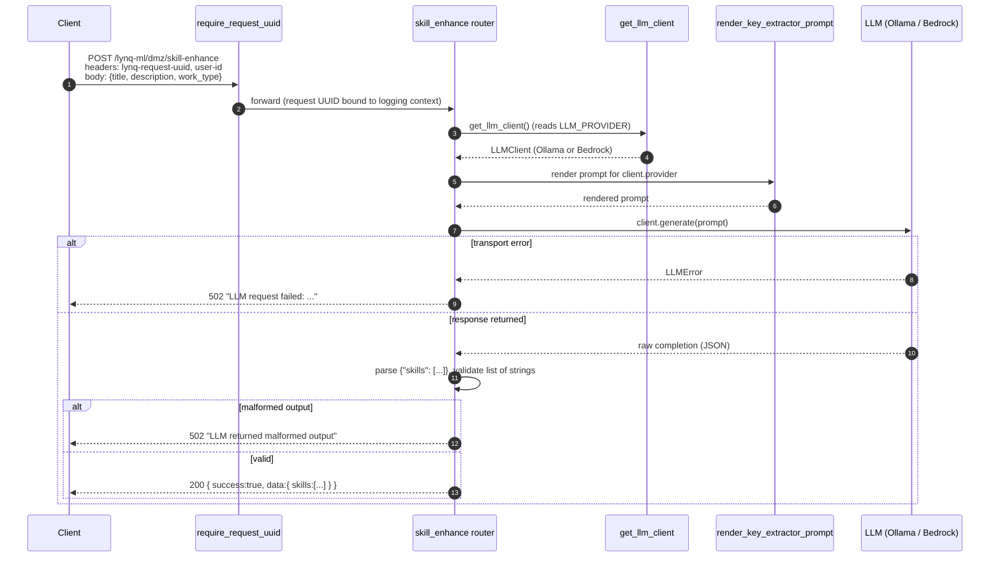

# lynq-ml

[](https://github.com/MatLock/UdeSA-lynq/actions/workflows/lynq-ml-test-workflow.yaml) [](https://github.com/MatLock/UdeSA-lynq/actions/workflows/lynq-ml-test-workflow.yaml)

Machine-learning service for the Lynq platform. A FastAPI app that augments the platform with LLM-backed features, served behind the standard `lynq-request-uuid` correlation header and the platform's `GlobalRestResponse` envelope. All features are backed by a pluggable LLM client (a local **Ollama** model by default, or **Amazon Bedrock**). It exposes:

- **Skill enhancement** — extract key technical skills from a job posting.
- **Resume skill extraction** — consolidate a whole resume's skills into technical/tools/soft buckets.
- **Upskilling suggestion** — assess a candidate against a job and return the skill gaps with real Udemy courses.
- **Candidate explanation** — turn the same candidate/job assessment into a recruiter hiring verdict with strengths and concerns.
- **Resume parsing** — download a resume (PDF/DOCX) and structure it into rich JSON.
- **Resume translation** — translate a structured resume into another language.
- **Language detection** — detect the main language of a text, ready to feed into translation.
- **Resume template** — render a structured resume into a styled PDF and upload it to S3.

---

## Table of contents

- [Technologies](#technologies)
- [Architecture](#architecture)
- [Request lifecycle](#request-lifecycle)
- [Skill extraction flow](#skill-extraction-flow)
- [API reference](#api-reference)
- [Sample requests](#sample-requests)
- [Running locally](#running-locally)
- [Running with Docker](#running-with-docker)
- [Configuration](#configuration)
- [Observability](#observability)
- [Testing](#testing)
- [Project layout](#project-layout)

---

## Technologies

| Area              | Stack                                                                     |
| ----------------- | ------------------------------------------------------------------------- |
| Language          | Python 3.12                                                               |
| Framework         | FastAPI 0.139 (Starlette), served by Uvicorn 0.50                         |
| Validation        | Pydantic 2                                                                |
| LLM backends      | Ollama (`/api/generate`, raw mode) or Amazon Bedrock (`converse`, any model) |
| Prompting         | Jinja2 templates, one variant per provider                                |
| HTTP client       | httpx (async) for Ollama, boto3 for Bedrock                               |
| Document parsing  | pypdf + python-docx (resume reader helpers)                               |
| Logging           | stdlib `logging` + `contextvars` MDC for per-request correlation IDs      |
| Build             | Dockerfile on `python:3.12-slim`                                          |
| Tests             | `unittest` (stdlib), FastAPI `TestClient`                                 |

---

## Architecture

```
                        ┌───────────────────────────┐
                        │       Client (HTTP)       │
                        └─────────────┬─────────────┘
                                      │  lynq-request-uuid, user-id, company-id?
                                      ▼
                ┌───────────────────────────────────────────┐
                │            HTTP middleware                │
                │   require_request_uuid   (all routes)     │
                │   + standard error-envelope handlers      │
                └─────────────┬─────────────────────────────┘
                              │
                              ▼
                ┌─────────────────────────────────┐
                │        skill_enhance router     │  POST /lynq-ml/dmz/skill-enhance
                └─────────────┬───────────────────┘
                              │
              ┌───────────────┼────────────────────┐
              ▼               ▼                     ▼
      ┌──────────────┐ ┌──────────────┐    ┌──────────────────┐
      │ get_llm_client│ │ render_key_  │    │  LLMClient       │
      │ (factory)     │ │ extractor_   │    │  .generate()     │
      │               │ │ prompt (jinja)│   │                  │
      └───────┬───────┘ └──────────────┘    └────────┬─────────┘
              │                                       │
              ▼                                       ▼
        selects provider                    ┌────────────────────┐
        from LLM_PROVIDER                    │ Ollama  /  Bedrock │
                                             │  HTTP / converse   │
                                             └────────────────────┘
```

**Layers**

- **Entrypoint** (`main.py`) — builds the FastAPI app, registers the request-UUID middleware, wires the standard exception handlers (from `exception_handlers.py`), mounts the `/lynq-ml` router (health + feature routers), and configures logging.
- **Exception handlers** (`exception_handlers.py`) — the `HTTPException`, `RequestValidationError`, and catch-all handlers that render the standard error envelope; `register_exception_handlers(app)` attaches them.
- **Middleware** (`middleware/`) — `require_request_uuid` enforces the `lynq-request-uuid` header on every non-exempt route and binds it to the logging context.
- **Feature router** (`skill_enhance/`) — the `POST /dmz/skill-enhance` endpoint plus its request/response models and the Jinja prompt renderer.
- **LLM clients** (`llm_client/`) — a common `LLMClient` interface with `OllamaClient` and `BedrockClient` implementations, selected by the `get_llm_client()` factory from environment configuration. Both raise `LLMError` on a backend failure, so the routers answer `502` without knowing which provider is configured.
- **Prompts** (`resources/prompts/`) — provider-specific Jinja templates (`job_post_skill_extraction/ollama.jinja`, `job_post_skill_extraction/bedrock.jinja`).
- **Response envelopes** (`response/`) — `GlobalRestResponse` / `ErrorRestResponse`, mirroring the Java services.
- **Logging context** (`logging_context.py`) — the MDC-style request-UUID contextvar and logging filter.
- **Document helpers** (`file_downloader/`, `file_reader/`) — download a resume from a presigned S3 URL and extract text from PDF/DOCX. Building blocks not yet exposed via an endpoint.

---

## Request lifecycle

Every request passes through the middleware and shared error handling before reaching a route:

| Step | Component                     | Scope                     | Purpose                                                                         |
| :--: | ----------------------------- | ------------------------- | ------------------------------------------------------------------------------- |
| 1    | `require_request_uuid`        | all routes except `/lynq-ml/health` | 403 if `lynq-request-uuid` is missing/blank; bind it to the logging context (MDC). |
| 2    | Route handler                 | matched route             | Validates headers/body via Pydantic; runs the feature logic.                    |
| 3    | Exception handlers            | all routes                | Map failures to the standard error envelope (see below).                        |

**Error envelope** — all failures return `ErrorRestResponse`:

| Situation                                   | Status | Body                                                              |
| ------------------------------------------- | :----: | ----------------------------------------------------------------- |
| Missing `lynq-request-uuid` header          | 403    | `{ success:false, reason:"Missing required header: lynq-request-uuid" }` |
| Invalid/malformed request fields            | 400    | `{ success:false, data:{<field>:<msg>}, reason:"Invalid Fields Found" }` |
| Raised `HTTPException` (e.g. LLM failure)    | 4xx/5xx | `{ success:false, reason:"<detail>" }`                            |
| Unhandled exception                         | 500    | `{ success:false, reason:"<message>" }`                           |

---

## Skill extraction flow


```mermaid
sequenceDiagram
    autonumber
    participant C as Client
    participant M as require_request_uuid
    participant R as skill_enhance router
    participant F as get_llm_client
    participant P as render_key_extractor_prompt
    participant L as LLM (Ollama / Bedrock)

    C->>M: POST /lynq-ml/dmz/skill-enhance<br/>headers: lynq-request-uuid, user-id<br/>body: {title, description, work_type}
    M->>R: forward (request UUID bound to logging context)
    R->>F: get_llm_client()  (reads LLM_PROVIDER)
    F-->>R: LLMClient (Ollama or Bedrock)
    R->>P: render prompt for client.provider
    P-->>R: rendered prompt
    R->>L: client.generate(prompt)
    alt transport error
        L-->>R: LLMError
        R-->>C: 502 "LLM request failed: ..."
    else response returned
        L-->>R: raw completion (JSON)
        R->>R: parse {"skills": [...]}, validate list of strings
        alt malformed output
            R-->>C: 502 "LLM returned malformed output"
        else valid
            R-->>C: 200 { success:true, data:{ skills:[...] } }
        end
    end
```

---

## API reference

Base path: `/lynq-ml`. Every business route lives behind the DMZ prefix `/lynq-ml/dmz`, reached only
from inside the platform — either through **lynq-bff**, the gateway that validates the JWT
signature, or from **lynq-app-backend** for the evaluations it assembles from its own database.
`/lynq-ml/health` stays outside the DMZ so infra probes can call it directly.

`user-id` and `company-id` are **log fields only**: neither reaches a prompt or any decision. That is
why `company-id` is optional on `skill-enhance`, which lynq-bff calls directly and which therefore
has no company to report.

> `parse-resume` and `resume-template-creation` take a URL (`preSignedUrl`, `profile_url`,
> `put_resume_url`) and hand it to `urllib.request.urlopen` server-side without validating the
> scheme or the host. That is safe only because the URLs are minted by lynq-file-storage and the
> endpoints are not reachable from a browser — lynq-bff refuses to relay them. Validate the URL here
> before opening either one up.

All routes require the `lynq-request-uuid` header **except** `/lynq-ml/health`.

| Method | Path                       | Extra headers required          | Description                                            |
| ------ | -------------------------- | ------------------------------- | ------------------------------------------------------ |
| POST   | `/dmz/skill-enhance`           | `user-id` (`company-id` optional) | Extract 5–15 key technical skills from a job posting. Called straight through lynq-bff. |
| POST   | `/dmz/resume/skill-extraction` | `user-id`                       | Consolidate a whole resume's skills into technical/tools/soft buckets. Called straight through lynq-bff. |
| POST   | `/dmz/upskilling_suggestion`   | `user-id`, `company-id`         | Assess a candidate vs. a job; return a verdict + Udemy courses for each gap. |
| POST   | `/dmz/candidate-explanation`   | `user-id`, `company-id`         | Assess a candidate vs. a job; return a hiring verdict with strengths and concerns. |
| POST   | `/dmz/parse-resume`            | `user-id`                       | Download a resume (PDF/DOCX) from a presigned URL and structure it into JSON. |
| POST   | `/dmz/translate`               | `user-id`                       | Translate every value of a structured resume into a target language. |
| POST   | `/dmz/detect-language`         | `user-id`                       | Detect the main language of a text; feeds straight into `/translate`. |
| POST   | `/dmz/resume-template-creation`| `user-id`                       | Render a structured resume into a styled PDF and upload it to a presigned URL. |
| GET    | `/health`                  | —                               | Liveness/readiness probe; reports service + LLM status.|

**`POST /dmz/skill-enhance`** request body:

```json
{
  "title": "Senior Backend Java Developer",
  "description": "Building scalable services with Java, Spring and AWS.",
  "work_type": "REMOTE"
}
```

`work_type` is an enum: `REMOTE` or `IN_OFFICE`. The response is wrapped in `GlobalRestResponse<SkillEnhanceResponse>`:

```json
{ "success": true, "data": { "skills": ["Java", "Spring", "AWS", "REST", "Docker"] } }
```

**`POST /dmz/resume/skill-extraction`**`?language=es` reads a whole structured resume and returns
its skills consolidated into three buckets. The request body is the `Resume` schema below (the same
one `/parse-resume` returns), so it chains straight off the parser — and since every field is
defaulted, a draft resume the candidate is still filling in validates too:

```json
{
  "personal_info": { "full_name": "Ada Lovelace" },
  "summary": "Backend engineer with 5 years building Java services.",
  "work_experience": [{ "company": "Acme", "position": "Backend Engineer", "technologies": ["Java", "Spring"] }]
}
```

The model reads the *whole* resume — `summary`, `work_experience.technologies`, `.description`,
`.achievements`, `projects`, `certifications` — not just the `skills` field, then deduplicates every
skill into exactly one bucket. The response is wrapped in `GlobalRestResponse<SkillExtractionResponse>`:

```json
{
  "success": true,
  "data": {
    "skills": ["Java", "Spring", "AWS"],
    "tools": ["Docker", "Git"],
    "soft": ["Liderazgo", "Comunicación"]
  }
}
```

- `skills`: technical skills — languages, frameworks, databases, cloud platforms, architecture concepts.
- `tools`: concrete tools, software and platforms (Docker, Git, Jira).
- `soft`: soft/interpersonal skills.
- `language` *(optional query param)*: the caller's UI language code (`en`, `es`; a region suffix
  like `es-AR` is accepted). Only `soft` is written in it — technical and tool names are proper
  nouns and are copied verbatim. Unknown or omitted codes fall back to English, so a resume drafted
  in one language never forces the soft skills into it.

Nothing is persisted: the caller decides which of the returned skills to keep. Malformed LLM output
returns `502`.

**`POST /dmz/upskilling_suggestion`** request body (the same `{ job, candidate }` structure the prompt consumes):

```json
{
  "job": {
    "description": "Backend role needing Kubernetes and GraphQL.",
    "skills": ["Java", "AWS", "Kubernetes", "GraphQL"]
  },
  "candidate": {
    "description": "Junior backend developer.",
    "skills": ["Java", "AWS"]
  }
}
```

The LLM returns a verdict plus 0–5 search queries (one per missing competency); each query is resolved to Udemy courses. The response is wrapped in `GlobalRestResponse<UpskillingResponse>`:

```json
{
  "success": true,
  "data": {
    "outcome": "Solid backend base; close the infra and API gaps below.",
    "suggestions": [
      {
        "query": "Kubernetes orchestration",
        "courses": [
          { "title": "Kubernetes for Developers", "url": "https://www.udemy.com/course/k8s-for-devs/" }
        ]
      }
    ]
  }
}
```

A perfect match yields `outcome: "You are perfect for this role."` and an empty `suggestions` array (no course lookup is made).

**Course lookup requires no API key.** Each search query is resolved by a keyless provider that finds real Udemy course links via a public web search and, when that is rate-limited or unavailable, falls back to a deterministic Udemy search deep-link for the topic — so the endpoint always returns useful links. Results are capped at `UDEMY_MAX_COURSES` (default **2**) per topic. (The Udemy Affiliate API is deprecated and is not used.)

**`POST /dmz/candidate-explanation`** takes the **same** `{ job, candidate }` payload as `/upskilling_suggestion`, but returns a recruiter-oriented hiring recommendation instead of course links. The response is wrapped in `GlobalRestResponse<CandidateExplanationResponse>`:

```json
{
  "success": true,
  "data": {
    "recommendation": "hire",
    "explanation": "Strong backend fundamentals that match the core of the role; the infra gap is coachable.",
    "strengths": ["Solid Java and AWS experience", "Relevant backend background"],
    "concerns": ["No hands-on Kubernetes", "No GraphQL experience"]
  }
}
```

`recommendation` is a short verdict label (e.g. `hire`, `no_hire`, `maybe`); `strengths` and `concerns` break the reasoning into points for and against hiring.

**`POST /dmz/parse-resume`** downloads a resume document (PDF/DOCX) from a presigned URL, extracts its text, and structures it into JSON via the LLM. Request body (the client sends camelCase; `pre_signed_url` is also accepted):

```json
{ "preSignedUrl": "https://s3.amazonaws.com/bucket/cv.pdf?X-Amz-Signature=..." }
```

The response is wrapped in `GlobalRestResponse<Resume>`. `Resume` is a rich, fully-defaulted schema — a partial completion still validates — with these top-level fields: `personal_info` (name, headline, email, phone, location, `links`), `summary`, `work_experience[]`, `education[]`, `skills` (`technical` / `tools` / `soft`), `languages[]`, `certifications[]`, `projects[]`:

```json
{
  "success": true,
  "data": {
    "personal_info": {
      "full_name": "Ada Lovelace",
      "headline": "Backend Engineer",
      "email": "ada@example.com",
      "location": "Buenos Aires, AR",
      "links": { "linkedin": "https://linkedin.com/in/ada", "github": "https://github.com/ada" }
    },
    "summary": "Backend engineer with 5 years building Java services.",
    "work_experience": [
      {
        "company": "Acme",
        "position": "Backend Engineer",
        "start_date": "2021-01",
        "end_date": null,
        "is_current": true,
        "achievements": ["Cut latency 40%"],
        "technologies": ["Java", "Spring", "AWS"]
      }
    ],
    "education": [],
    "skills": { "technical": ["Java", "Spring"], "tools": ["Docker"], "soft": ["Communication"] },
    "languages": [{ "language": "English", "proficiency": "C1" }],
    "certifications": [],
    "projects": []
  }
}
```

Unsupported document types return `400`; download/parse failures and malformed LLM output return `502`.

**`POST /dmz/translate`** translates every value of a structured resume into a target language. It reuses the `Resume` model from `/parse-resume`, so it is the natural next step in the pipeline. Request body:

```json
{
  "resume": { "personal_info": { "full_name": "Ada Lovelace" }, "summary": "Backend engineer..." },
  "language": "ES"
}
```

`language` is validated against the `Language` enum — `EN`, `ES`, `FR`, `PR` (mirrors `com.lynq.backend.enums.Language`); any other value fails validation. The response is the translated resume wrapped in `GlobalRestResponse<Resume>`.

**`POST /dmz/detect-language`** detects the main language of a free-form text (typically a resume's,
before offering to translate it). Request body:

```json
{ "text": "Ingeniero backend con 5 años construyendo servicios en Java." }
```

The response is wrapped in `GlobalRestResponse<LanguageDetectionResponse>`, whose `language` is
constrained to the same `Language` enum `/translate` accepts — so a detected language can be fed
straight back into it:

```json
{ "success": true, "data": { "language": "ES" } }
```

The model is instructed to pick the closest supported language rather than answer with an
unsupported one; output that is not a valid enum value returns `502`.

**`POST /dmz/resume-template-creation`** renders a structured resume into a styled PDF (Jinja + WeasyPrint) and uploads it to a caller-provided presigned S3 PUT URL — the service never holds AWS credentials. Request body:

```json
{
  "resume_content": { "personal_info": { "full_name": "Ada Lovelace" }, "summary": "Backend engineer..." },
  "profile_url": "https://s3.amazonaws.com/bucket/photo.jpg?X-Amz-Signature=...",
  "put_resume_url": "https://s3.amazonaws.com/bucket/cv.pdf?X-Amz-Signature=...",
  "template": "MODERN"
}
```

- `resume_content`: the structured resume to render (the `Resume` schema above).
- `profile_url` *(optional)*: presigned URL to the profile photo; omit it to render without an avatar.
- `put_resume_url`: presigned S3 PUT URL the rendered PDF is streamed to.
- `template`: visual template — `MODERN` (default) or `CLASSIC`, each backed by `resources/resume_template/<name lowercased>/`.

Returns `201 Created` with an empty `GlobalRestResponse` once the PDF has been generated and stored. Render failures return `500`; upload failures return `502`.

**`GET /health`** returns `200` when the configured LLM is reachable, `503` otherwise (this route is *not* wrapped in `GlobalRestResponse`):

```json
{ "status": "UP", "llm": { "provider": "ollama", "status": "UP" } }
```

---

## Sample requests

> Substitute `$UUID` with any UUID you generate per request (e.g. `uuidgen`).

**Extract skills**

```bash
curl -X POST http://localhost:8084/lynq-ml/dmz/skill-enhance \
  -H "Content-Type: application/json" \
  -H "lynq-request-uuid: $UUID" \
  -H "user-id: user-1" \
  -H "company-id: company-1" \
  -d '{
    "title": "Senior Backend Java Developer",
    "description": "Building scalable services with Java, Spring and AWS.",
    "work_type": "REMOTE"
  }'
```

**Extract a resume's skills**

```bash
curl -X POST "http://localhost:8084/lynq-ml/dmz/resume/skill-extraction?language=es" \
  -H "Content-Type: application/json" \
  -H "lynq-request-uuid: $UUID" \
  -H "user-id: user-1" \
  -d '{
    "personal_info": { "full_name": "Ada Lovelace" },
    "summary": "Backend engineer with 5 years building Java services.",
    "skills": { "technical": ["Java", "Spring"], "tools": ["Docker"], "soft": ["Leadership"] }
  }'
```

**Upskilling suggestion**

```bash
curl -X POST http://localhost:8084/lynq-ml/dmz/upskilling_suggestion \
  -H "Content-Type: application/json" \
  -H "lynq-request-uuid: $UUID" \
  -H "user-id: user-1" \
  -H "company-id: company-1" \
  -d '{
    "job": {
      "description": "Backend role needing Kubernetes and GraphQL.",
      "skills": ["Java", "AWS", "Kubernetes", "GraphQL"]
    },
    "candidate": {
      "description": "Junior backend developer.",
      "skills": ["Java", "AWS"]
    }
  }'
```

**Candidate explanation**

```bash
curl -X POST http://localhost:8084/lynq-ml/dmz/candidate-explanation \
  -H "Content-Type: application/json" \
  -H "lynq-request-uuid: $UUID" \
  -H "user-id: user-1" \
  -H "company-id: company-1" \
  -d '{
    "job": {
      "description": "Backend role needing Kubernetes and GraphQL.",
      "skills": ["Java", "AWS", "Kubernetes", "GraphQL"]
    },
    "candidate": {
      "description": "Junior backend developer.",
      "skills": ["Java", "AWS"]
    }
  }'
```

**Parse resume**

```bash
curl -X POST http://localhost:8084/lynq-ml/dmz/parse-resume \
  -H "Content-Type: application/json" \
  -H "lynq-request-uuid: $UUID" \
  -H "user-id: user-1" \
  -d '{ "preSignedUrl": "https://s3.amazonaws.com/bucket/cv.pdf?X-Amz-Signature=..." }'
```

**Translate resume**

```bash
curl -X POST http://localhost:8084/lynq-ml/dmz/translate \
  -H "Content-Type: application/json" \
  -H "lynq-request-uuid: $UUID" \
  -H "user-id: user-1" \
  -d '{
    "resume": { "personal_info": { "full_name": "Ada Lovelace" }, "summary": "Backend engineer..." },
    "language": "ES"
  }'
```

**Detect a language**

```bash
curl -X POST http://localhost:8084/lynq-ml/dmz/detect-language \
  -H "Content-Type: application/json" \
  -H "lynq-request-uuid: $UUID" \
  -H "user-id: user-1" \
  -d '{ "text": "Ingeniero backend con 5 años construyendo servicios en Java." }'
```

**Create resume template (PDF)**

```bash
curl -X POST http://localhost:8084/lynq-ml/dmz/resume-template-creation \
  -H "Content-Type: application/json" \
  -H "lynq-request-uuid: $UUID" \
  -H "user-id: user-1" \
  -d '{
    "resume_content": { "personal_info": { "full_name": "Ada Lovelace" }, "summary": "Backend engineer..." },
    "put_resume_url": "https://s3.amazonaws.com/bucket/cv.pdf?X-Amz-Signature=...",
    "template": "MODERN"
  }'
```

**Health check**

```bash
curl http://localhost:8084/lynq-ml/health
```

---

## Running locally

**Prerequisites**

- Python 3.12
- A reachable LLM backend — either a local Ollama server (default) or AWS credentials allowed to invoke a Bedrock model.

**Steps**

```bash
# 1. Create the virtualenv and install dependencies
python3.12 -m venv .venv
source .venv/bin/activate
pip install -r requirements.txt

# 2. Start an LLM backend. Easiest: the Ollama services from the repo-root compose file,
#    which expose Ollama on localhost:11434 and pull llama3.1:
docker compose -f ../docker-compose.yaml up -d ollama ollama-pull

# 3. Export the service environment (defaults to Ollama on localhost)
source ./set_env.sh

# 4. Run the service
python src/main.py
```

Service URL: `http://localhost:8084/lynq-ml` (health at `/lynq-ml/health`).

To use Amazon Bedrock instead of a local model. `BEDROCK_MODEL_ID` is any model
the Converse API accepts, so the provider is a config choice, not a code change:

```bash
export AWS_PROFILE=lynq            # or AWS_ACCESS_KEY_ID / AWS_SECRET_ACCESS_KEY
LLM_PROVIDER=bedrock \
  BEDROCK_MODEL_ID=anthropic.claude-sonnet-4-5-20250929-v1:0 \
  BEDROCK_REGION=us-east-1 \
  source ./set_env.sh
python src/main.py
```

Swapping the model is only a variable — `amazon.nova-pro-v1:0`,
`meta.llama3-3-70b-instruct-v1:0` and `mistral.*` need no code change. The model
must be enabled in that region's Bedrock console, and the caller needs
`bedrock:InvokeModel` on it.

---

## Running with Docker

The repo-root `docker-compose.yaml` provisions `lynq-ml` together with an Ollama server and a one-shot job that pulls the default model. Run compose from the repository root (one level up from this module):

```bash
cd ..
docker compose up --build lynq-ml ollama ollama-pull
```

In compose, `lynq-ml` reaches Ollama on the compose network at `http://ollama:11434` and waits for the model pull to finish (healthchecks gate startup). The service is published on `http://localhost:8084/lynq-ml`.

To bring up the whole platform instead:

```bash
docker compose up --build
```

---

## Configuration

All configuration is via environment variables (see `set_env.sh` for defaults):

| Variable          | Default                     | Used when            | Purpose                                              |
| ----------------- | --------------------------- | -------------------- | ---------------------------------------------------- |
| `LLM_PROVIDER`    | `ollama`                    | always               | Selects the LLM backend: `ollama` or `bedrock`.      |
| `LLM_TIMEOUT`     | `60`                        | always               | LLM request timeout, in seconds.                     |
| `OLLAMA_BASE_URL` | `http://localhost:11434`    | `LLM_PROVIDER=ollama`| Ollama server base URL.                              |
| `OLLAMA_MODEL`    | `llama3.1`                  | `LLM_PROVIDER=ollama`| Ollama model name.                                   |
| `BEDROCK_MODEL_ID` | — (required)               | `LLM_PROVIDER=bedrock`| Any Converse-capable model id (`anthropic.*`, `amazon.nova-*`, `meta.llama*`, `mistral.*`). |
| `BEDROCK_REGION`  | `AWS_REGION`, else `us-east-1` | `LLM_PROVIDER=bedrock`| Region whose Bedrock endpoint is called.        |
| `BEDROCK_MAX_TOKENS` | `4096`                   | `LLM_PROVIDER=bedrock`| `inferenceConfig.maxTokens` per request.          |
| `BEDROCK_TEMPERATURE` | `0`                     | `LLM_PROVIDER=bedrock`| `inferenceConfig.temperature` per request.        |
| `BEDROCK_MAX_ATTEMPTS` | `3`                    | `LLM_PROVIDER=bedrock`| botocore retry attempts (standard mode).          |
| `UDEMY_MAX_COURSES` | `2`                       | `/upskilling_suggestion` | Max courses returned per topic.                   |
| `UDEMY_BASE_URL`  | `https://www.udemy.com`     | `/upskilling_suggestion` | Udemy base URL (course + search links).          |
| `COURSE_SEARCH_TIMEOUT` | `15`                  | `/upskilling_suggestion` | Web-search request timeout, in seconds.          |
| `HOST`            | `0.0.0.0`                   | always               | Bind host (`python src/main.py`).                    |
| `PORT`            | `8084`                      | always               | Bind port.                                           |
| `LOG_LEVEL`       | `INFO`                      | always               | Root log level.                                      |
| `LOG_COLORS`      | `true`                      | always               | Colourised per-level logs; set `false` for files/CI. |

---

## Observability

- **Logs** — stdlib `logging` configured in `main.py` with Uvicorn's colourising formatters, streamed to stdout. Every log line is prefixed with the request UUID (`[<lynq-request-uuid>]`) via a `contextvars`-backed MDC filter (`logging_context.py`), mirroring the `%X{requestId}` pattern used by the Java services. Logs emitted outside a request show `[-]`.
- **Health** — `GET /lynq-ml/health` reports the service status and whether the configured LLM backend is reachable (`200 UP` / `503 DOWN`). It is exempt from the request-UUID header so infra probes can call it directly.

---

## Testing

Tests use the standard-library `unittest` framework with FastAPI's `TestClient`; LLM and HTTP collaborators are mocked, so no network or model is required. Application code lives under `src/`, which must be on the import path. Run from the module root:

```bash
# The tests package puts src/ on the path, so the bare command works:
python -m unittest discover

# Invocation-independent equivalent (e.g. for CI):
PYTHONPATH=src python -m unittest discover -s tests
```

Coverage includes the `skill-enhance` and `health` endpoints, the request-UUID middleware and logging context, the prompt renderer, the `get_llm_client` factory, and the Ollama (httpx mocked) and Bedrock (boto3 mocked) clients.

---

## Project layout

```
lynq-ml/
├── src/                        # application sources root (on the import path)
│   ├── main.py                 # FastAPI app wiring, router mounting, logging setup
│   ├── exception_handlers.py   # standard error-envelope handlers + registrar
│   ├── logging_context.py      # Request-UUID contextvar + logging filter (MDC)
│   ├── middleware/
│   │   └── request_uuid.py     # require_request_uuid middleware
│   ├── router/                 # HTTP routers, one module per feature
│   │   ├── health.py           # GET /health probe
│   │   ├── skill_enhance.py    # POST /skill-enhance
│   │   ├── upskilling_suggestion.py # POST /upskilling_suggestion
│   │   ├── candidate_explanation.py # POST /candidate-explanation
│   │   ├── resume_extractor.py # POST /parse-resume
│   │   ├── translation.py      # POST /translate
│   │   └── resume_template.py  # POST /resume-template-creation
│   ├── model/                  # Pydantic models, one module per feature
│   │   ├── skill_enhance.py    # SkillEnhanceRequest/Response, WorkType enum
│   │   ├── upskilling_suggestion.py # UpskillingRequest/Response, QuerySuggestion
│   │   ├── candidate_explanation.py
│   │   ├── resume_extractor.py # Resume and nested schemas
│   │   ├── translation.py      # TranslateRequest, Language enum
│   │   └── resume_template.py  # ResumeTemplateCreationRequest, Template enum
│   ├── prompt/                 # LLM prompt renderers, one module per feature
│   │   ├── skill_enhance.py    # render_key_extractor_prompt (Jinja)
│   │   ├── upskilling_suggestion.py # render_upskilling_prompt (Jinja)
│   │   ├── candidate_explanation.py # render_candidate_explanation_prompt
│   │   ├── resume_extractor.py # render_resume_extractor_prompt
│   │   └── translation.py      # render_translation_prompt
│   ├── renderer/
│   │   └── resume_template.py  # render_resume_pdf (Jinja + WeasyPrint)
│   ├── llm_client/
│   │   ├── base.py             # LLMClient interface, LLMProvider enum
│   │   ├── ollama_client.py    # Ollama implementation
│   │   ├── bedrock_client.py   # Amazon Bedrock (Converse) implementation
│   │   └── __init__.py         # get_llm_client() factory
│   ├── udemy_client/
│   │   ├── search_client.py    # keyless Udemy course search (+ fallback)
│   │   ├── models.py           # Course value object
│   │   └── __init__.py         # get_course_provider() factory
│   ├── response/
│   │   └── models.py           # GlobalRestResponse, ErrorRestResponse
│   ├── file_downloader/        # presigned-URL download helper
│   └── file_reader/            # resume text extraction (PDF/DOCX)
├── resources/                  # service config + assets (loaded at runtime)
│   ├── log_config.json         # logging dictConfig
│   └── prompts/
│       ├── job_post_skill_extraction/ # ollama.jinja, bedrock.jinja
│       └── upskilling_suggestion/     # ollama.jinja, bedrock.jinja
├── tests/                      # unittest suite (puts src/ on the path)
├── set_env.sh                  # environment defaults
├── Dockerfile
├── requirements.in             # direct dependencies (source of truth)
└── requirements.txt            # full lock with hashes (pip-compile --generate-hashes requirements.in)
```
